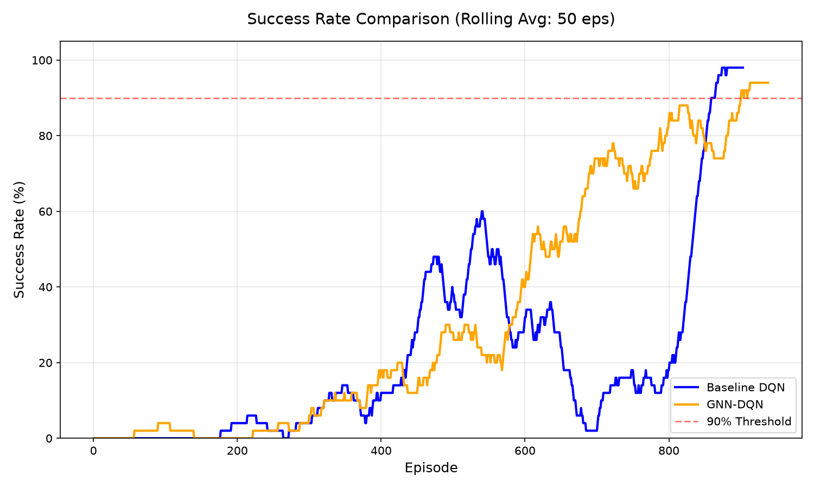
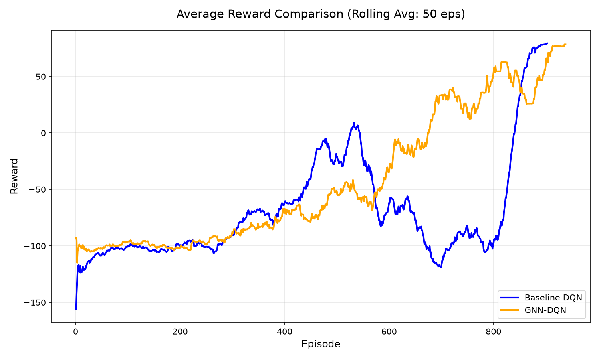

# 🏢 Adaptive Evacuation with GNN-Enhanced DQN


An intelligent building evacuation system that combines **Graph Neural Networks (GNN)** with **Deep Q-Networks (DQN)** to guide agents through dynamically changing building environments with spreading fire and smoke hazards.

Developed as part of the 12-week research roadmap during the **International Internship Pilot Program (IIPP)** at the **Intelligent Networks & Edge-Cloud Computing (INEC) Laboratory, Yuan Ze University, Taiwan**.

---

## 🎯 Research Objective

Develop a novel **GCN-Enhanced DQN** framework for adaptive emergency evacuation in buildings with dynamic hazards — targeting IEEE conference publication. The agent must learn to:

1. Navigate complex building layouts to reach exit points
2. Avoid dynamically spreading fire and smoke
3. Find optimal evacuation routes under time pressure
4. Adapt to changing hazard conditions in real-time

---

## 🚀 Project Status
- **Phase 1 (Completed)**: Core benchmark environment built with 5 layouts. Standard DQN baselines implemented. Discovered zero-shot spatial generalization flaw in pure DQN.
- **Phase 2 (In Progress)**: Pivoted to **Graph Neural Network (GNN) + DQN Hybrid** to achieve >90% precision on unseen starting coordinates.
  - Implemented True A* Path Distance dense reward.
  - Implemented cell revisit penalties to prevent infinite loops.
  - Injected static Fire hazards into all map parsers.
  - Configured 9-channel state observation for GNN translation.

### Experiment Results: MARL Bottlenecks
While single-agent models (DQN, GNN, Hybrid) successfully learn to evade fire and reach exits, the **Multi-Agent GNN** experiment (3 agents) resulted in a 0% success rate. The agents lack explicit inter-agent communication, causing them to physically block each other in narrow corridors (deadlocks) until the fire consumes them. This finding paves the way for future research into Communication Networks (CommNets).

<p align="center">
  
  
</p>

### What's Working

| Component | Description | Status |
| :--- | :--- | :---: |
| **Grid Generation** | Procedural mazes, static layouts, A* path validation | ✅ |
| **Fire Dynamics** | Spreading cellular automata for fire and smoke | ✅ |
| **ANSI Terminal Renderer** | Colourized real-time visualization | ✅ |
| **YAML Config System** | Fully configurable grid, rewards, dynamics, agent | ✅ |
| **Double DQN Agent** | Baseline agent with target network and replay buffer | ✅ |
| **Graph Neural Network (GNN)** | PyG `GCNConv` message passing architecture | ✅ |
| **Hybrid Heuristic System** | Dynamic A* shortest-path injected into GNN features | ✅ |
| **MARL Environment** | Multi-agent Gymnasium subclass with collision logic | ✅ |
| **Node-Specific GNN Extractors**| Allows multiple agents to share 1 GNN via unique spatial IDs | ✅ |
| **Variable-Size Transfer** | Zero-shot evaluation on larger unseen grids (15x15) | ✅ |
| **Training Pipeline** | Full training loops for DQN, GNN, and MARL with early stopping | ✅ |
| **Unit Test Suite** | 82 tests covering all environment, DQN, and GNN components | ✅ |

---

## 🏗️ Architecture

```
┌─────────────────────────────────────────────────────────────┐
│                    EvacuationEnv (Gymnasium)                 │
│                                                             │
│   ┌──────────┐  ┌────────────────┐  ┌──────────────────┐   │
│   │   Grid   │  │ EnvironmentState│  │    Building      │   │
│   │ 2D cells │  │ agent/fire/smoke│  │ fire/smoke spread│   │
│   └──────────┘  └────────────────┘  └──────────────────┘   │
│                         │                                   │
│               ┌─────────┴──────────┐                        │
│               │                    │                        │
│        to_observation()      to_graph()                     │
│        flat vector (100,)    node_feat (100,8)              │
│                              edge_idx (2,360)               │
│                                                             │
│   ┌──────────┐  ┌────────────────┐  ┌──────────────────┐   │
│   │ Renderer │  │ compute_reward │  │  Config Loader   │   │
│   │  ANSI    │  │ multi-objective│  │    YAML parser   │   │
│   └──────────┘  └────────────────┘  └──────────────────┘   │
└─────────────────────────────────────────────────────────────┘
```

---

## 🎮 The Environment

### Grid Layout (10×10 Default)

```
·  ·  ·  ·  ·  ·  ·  ·  ·  E     A = Agent (start)
·  █  █  ·  ·  ·  ·  ·  ·  ·     E = Exit
·  █  ·  ·  ·  ·  ·  ·  ·  ·     █ = Wall
·  ·  ·  ·  ·  █  ·  ·  ·  ·     F = Fire source
·  ·  █  ·  ·  █  ·  ·  ·  ·     ░ = Smoke
·  ·  F  ·  ·  █  ·  ·  ·  ·     · = Empty
·  ·  ·  █  █  ·  ·  ·  ·  ·
·  ·  ·  ·  ·  ·  ·  █  █  ·
·  ·  ·  ·  ·  █  ·  ·  ·  ·
E  ·  ·  ·  ·  ·  ·  ·  ·  ·
```

### Environment Specifications

> Note: the apartment layout now uses a different fire cell location than before, so any apartment-specific evaluation should use the updated map definition in [maps/apartment.py](maps/apartment.py).

| Property | Details |
|---|---|
| **Grid Size** | 10×10 (configurable) |
| **Observation** | Flat integer vector, shape `(100,)`, values 0–7 |
| **Actions** | 5 discrete: UP, DOWN, LEFT, RIGHT, STAY |
| **Fire Spread** | Probabilistic (30% per neighbor per step) |
| **Smoke Radius** | Manhattan distance 2 around fire |
| **Max Steps** | 200 per episode |

### Reward Structure

| Event | Reward | Terminates? |
|---|---|---|
| Reach Exit | `+100` | ✅ Yes |
| Step into Fire | `-50` | ✅ Yes |
| Step into Smoke | `-10` | ❌ No |
| Wall Bump | `-5` | ❌ No |
| Normal Step | `-1` | ❌ No |
| Stay Action | `-2` | ❌ No |

### Dynamic Hazards

Fire spreads **indefinitely** — each timestep, every burning cell has a 30% chance of igniting each adjacent empty or smoke cell. This creates escalating urgency:

```
Step 1:          Step 10:         Step 30:
·  ·  ·          ·  ░  ·          ░  ░  ░
·  F  ·    →     ░  F  ░    →    F  F  F
·  ·  ·          ·  F  ·         ░  F  F
```

---

## 🚀 Getting Started

### Prerequisites

```bash
pip install gymnasium torch numpy matplotlib pyyaml pytest
```

### Run the Random Agent Demo

```bash
cd Adaptive-Evacuation-GNN-DQN
python scripts/demo_random.py
```

You'll see an animated terminal display with the agent moving randomly, fire spreading, and rewards being tracked.

### Run the Test Suite

```bash
cd Adaptive-Evacuation-GNN-DQN
python -m pytest tests/test_environment.py -v
```

```
============================= 46 passed in 0.92s ==============================
```

### Use in Your Code

```python
from utils.config_loader import load_config
from environment import EvacuationEnv

config = load_config("configs/default.yaml")
env = EvacuationEnv(config, render_mode="human")

obs, info = env.reset(seed=42)

for _ in range(100):
    action = env.action_space.sample()
    obs, reward, terminated, truncated, info = env.step(action)
    if terminated or truncated:
        break

# For GNN-based agents:
graph = env.get_graph_observation()
# graph["node_features"].shape → (100, 8)   — one-hot cell types
# graph["edge_index"].shape   → (2, 360)    — bidirectional 4-connected
```

---

## 📁 Project Structure

```
Adaptive-Evacuation-GNN-DQN/
│
├── environment/                    # Core environment package
│   ├── __init__.py                 # Public API exports
│   ├── constants.py                # CellType, Action, RewardConfig
│   ├── grid.py                     # 2D grid with neighbor queries
│   ├── actions.py                  # Action application & validation
│   ├── state.py                    # State manager + graph conversion
│   ├── reward.py                   # Multi-objective reward function
│   ├── building.py                 # Fire spread & smoke dynamics
│   ├── evacuation_env.py           # Gymnasium Env subclass
│   ├── renderer.py                 # ANSI terminal renderer
│   ├── entities/                   # Entity definitions (future)
│   └── maps/
│       └── floor1.yaml             # Default 10×10 floor plan
│
├── models/                         # Neural network architectures
│   ├── common/                     # Shared layers & losses
│   ├── dqn/                        # Deep Q-Network components
│   ├── gnn/                        # Graph Neural Network components
│   └── hybrid/                     # GNN-DQN fusion model
│
├── training/                       # Training scripts & loops
├── evaluation/                     # Metrics & comparison tools
├── visualization/                  # Plotting & animation
├── experiments/                    # Experiment configurations
│
├── configs/
│   └── default.yaml                # Default environment config
│
├── utils/
│   ├── __init__.py
│   └── config_loader.py            # YAML config loader
│
├── scripts/
│   └── demo_random.py              # Random agent demo
│
├── tests/
│   └── test_environment.py         # 46 unit tests
│
├── knowledge/                      # Research notes & ideas
├── docs/                           # Documentation & logs
├── paper/                          # Research paper drafts
├── data/                           # Datasets & graphs
├── checkpoints/                    # Saved model weights
├── results/                        # Training results & plots
├── assets/                         # Images & diagrams
├── notebooks/                      # Jupyter notebooks
│
├── main.py                         # Project entry point
├── requirements.txt                # Python dependencies
├── environment.yml                 # Conda environment spec
├── LICENSE                         # License file
└── README.md                       # This file
```

---

## 🔬 Research Roadmap

```
Week 1  ✅  Q-Learning & GridWorld (tabular RL from scratch)
Week 2  ✅  DQN on CartPole-v1 (PyTorch, Experience Replay, Target Network)
Week 3  ✅  Phase 1: Gymnasium Evacuation Environment ← Current
Week 4  🔜  Phase 2: DQN Agent + Training Pipeline
Week 5  🔜  Phase 3: GNN Feature Extractor (GCN/GAT)
Week 6  🔜  Phase 4: GNN-Enhanced DQN Hybrid Architecture
Week 7  🔜  Phase 5: Baselines, Ablations & Evaluation
Week 8  🔜  Phase 6: Paper Writing & Submission
```

---

## 🧪 Testing

The test suite covers 7 areas with 46 tests:

| Test Class | Coverage Area | Tests |
|---|---|---|
| `TestGrid` | Grid creation, cell ops, neighbors, NumPy export | 10 |
| `TestActions` | Action application, boundary checks, fire validity | 9 |
| `TestReward` | All 6 reward event types | 6 |
| `TestState` | State reset, observation shape, graph structure | 4 |
| `TestBuilding` | Fire spread (deterministic/zero/walls), smoke | 5 |
| `TestEvacuationEnv` | Full lifecycle, exit/fire/truncation, observations | 10 |
| `TestConfigLoader` | YAML loading, missing file errors | 2 |

---

## ⚙️ Configuration

All environment parameters are controlled via YAML:

```yaml
grid:
  rows: 10
  cols: 10

map:
  walls: [[1,1], [1,2], ...]
  exits: [[0,9], [9,0]]
  fire_sources: [[5,2]]
  agent_start: [[0,0]]

dynamics:
  fire_spread_probability: 0.3
  smoke_radius: 2
  max_steps: 200

rewards:
  exit_reached: 100.0
  fire_hit: -50.0
  smoke_step: -10.0
  wall_bump: -5.0
  normal_step: -1.0
  stay_penalty: -2.0
```

---

## 👨‍💻 Author

**Rikesh Yadav**
Computer Science & Engineering
Sri Eshwar College of Engineering, India

**Research Intern** — International Internship Pilot Program (IIPP)
**Laboratory:** Intelligent Networks and Edge-Cloud Computing (INEC Lab)
**Institution:** Yuan Ze University, Taoyuan, Taiwan
**Supervisor:** Assistant Professor Dr. Ihsan Ullah
**Internship Period:** June – August 2026

📧 GitHub: [github.com/Rieck-Ace](https://github.com/rieckace)

---

## 📚 References

- Mnih, V. et al. (2013). *Playing Atari with Deep Reinforcement Learning.* DeepMind.
- Mnih, V. et al. (2015). *Human-level control through deep reinforcement learning.* Nature, 518, 529–533.
- Kipf, T. N. & Welling, M. (2017). *Semi-Supervised Classification with Graph Convolutional Networks.* ICLR.
- OpenAI Gymnasium: [gymnasium.farama.org](https://gymnasium.farama.org)
- PyTorch Geometric: [pyg.org](https://pyg.org)

---

> *"An agent that adapts to its environment is more powerful than one that follows fixed rules."*

---

⭐ If this project interests you, consider starring the repository!
